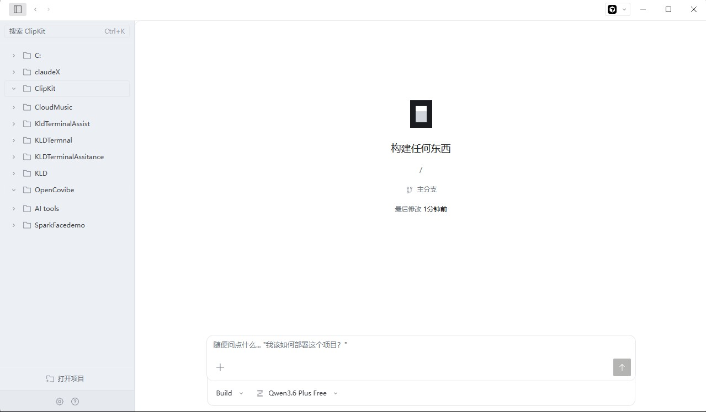
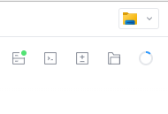
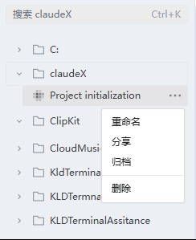
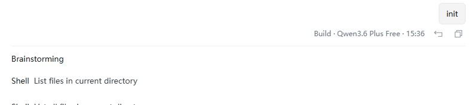
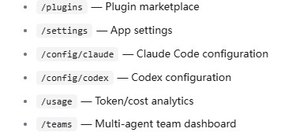

# Opencodex

  <strong>English</strong> · <a href="README.zh.md">简体中文</a>

Opencodex is still essentially [opencode](https://github.com/anomalyco/opencode), with the desktop UI reorganized for clarity. You can still use free models, and your existing API settings, model configuration, and overall workflow stay the same.

Desktop release: [v0.1.0](https://github.com/The-R0/opencode-X/releases/tag/v0.1.0)

## UI differences from official OpenCode

### Main UI

### Sidebar recognition

In the original layout, it is hard to tell what the different C and K letters are supposed to mean at a glance.

Opencodex turns that area into a proper project tree: projects read like blocks, sessions live under the project they belong to, and the open-project action stays fixed below the scroll area.

### Toolbar comparison

| Official OpenCode | Current Opencodex |
|-------------------|-------------------|
|  |  |

The toolbar is simplified so project access and session actions feel less scattered.

### Session actions

Putting rename and delete for a session in the top-right corner of the session box is awkward. Those actions belong beside the session they act on, not detached from it.

Opencodex moves that menu to the right side of the session row in the left sidebar, so path-related actions feel tied to the correct item instead of floating elsewhere in the page.

### Plan placement

| Official OpenCode | Current Opencodex |
|-------------------|-------------------|
|  |  |

The old centered PLAN block is visually loud and gets in the way of the main conversation. Opencodex moves progress into a quieter right-side area so the chat stays primary.

### Message styling

User and model turns are easier to scan because the conversation now carries clearer visual markers instead of feeling like one flat block of text.

### Code and path tone

File paths and inline code no longer jump out in green. They use a softer gray emphasis so the page reads more evenly without losing structure.

### Main changes

- Project rail becomes a project tree with nested sessions.
- Project headers become clearer blocks with chevron, folder glyph, and inline rename.
- Open project stays outside the scroll list instead of getting buried.
- Session actions live next to the session row instead of farther away in the top area.
- Progress no longer sits in the middle of the composer area.
- User and model turns have clearer visual markers.
- File paths and inline code shift from green emphasis to a softer gray shadowed tone.
- Overall spacing, borders, and reading density move closer to a calmer Codex-like workspace.

## Upstream

- Upstream: [anomalyco/opencode](https://github.com/anomalyco/opencode)
- This fork tracks `dev` and layers desktop UX commits on top.
- CLI, server, and plugin stack remain largely unchanged from opencode.

## Status

Experimental personal fork; expect fast iteration. Feedback welcome via [Issues](https://github.com/The-R0/Opencodex/issues).

## License

MIT, same as opencode; see [LICENSE](./LICENSE).
