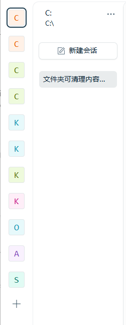
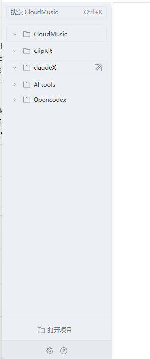
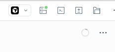
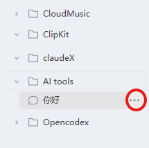

# Opencodex

<p align="center">
  <strong>简体中文</strong> · <a href="README.md">English</a>
</p>

**Opencodex** 是本仓库名；安装的桌面应用仍显示为 **OpenCode**，与官方桌面版共用同一套用户数据与模型配置。

本仓库是 [opencode](https://github.com/anomalyco/opencode) 的非官方分支，主要面向 **桌面端（Electron）** 做 UI 实验（层级侧边栏、Codex 主题等）。内核与官方相同，**API Key、模型、项目数据与官方 OpenCode 桌面版共用**。

| 数据 | 路径（Windows） |
|------|-----------------|
| 桌面壳设置、窗口状态 | `%APPDATA%\ai.opencode.desktop\` |
| 模型 / API Key / 认证 | `%APPDATA%\opencode\` |

> 本 fork 与 OpenCode 官方团队无关，也不代表上游产品方向。

## 主要改动

## 当前 UI 和官方 OpenCode 的差异

Opencodex 保持 OpenCode 的核心引擎和配置路径不变，但桌面端 UI 有明显调整。最大的变化在左侧栏：项目被当成一级工作区块，会话嵌套在所属项目下面。

### 左侧栏前后对比

| 官方 OpenCode | 当前 Opencodex |
|-------------------|-------------------|
|  |  |

### 顶部工具栏前后对比

| 官方 OpenCode | 当前 Opencodex |
|-------------------|-------------------|
|  |  |

### 项目树和会话菜单



主要差异：

- **从项目头像 rail 变成项目树**：展开后的桌面侧边栏直接显示项目，并把最近会话挂在项目下。
- **项目标题变成项目块**：项目行包含边框、展开箭头、文件夹图标、可编辑项目名，以及 hover 出现的新建会话按钮。
- **打开项目固定在列表外**：打开项目按钮放在滚动项目树下方，不会因为项目太多被滚走。
- **会话行有独立操作入口**：嵌套会话行右侧有 `...` 菜单，可做重命名、分享、归档、删除等操作。
- **更接近 Codex 的紧凑视觉**：侧边栏颜色、边框、内联重命名输入框和 Markdown 阅读节奏都做了更轻的处理。

### 视觉与主题

- **Codex 主题**：在设置中可选择 `codex` 主题（浅色 / 深色），整体对比与排版更贴近 Codex 风格。
- **排版与 Markdown**：对部分字号、行高与 Markdown 展示做了微调，长会话阅读更舒服。

### 层级侧边栏（Hierarchy Sidebar）

侧边栏展开时，使用 **项目 → 会话** 的树形结构（类似 Cursor 左侧栏），替代原先「项目条 + 右侧面板」的组合：

| 能力 | 说明 |
|------|------|
| 项目折叠 | 左侧箭头展开 / 收起项目下的会话列表 |
| 项目图标 | 统一为线框文件夹图标；**Shift + 点击** 项目图标可在三种样式间切换（`folder` / `file-tree` / `folder-add-left`），选择会保存在本地 |
| 选中样式 | 当前项目为 **细线框** 高亮，避免大面积色块刺眼 |
| 新建会话 | 悬停项目行右侧可出现「新建会话」按钮 |
| 会话菜单 | 悬停会话行显示 **⋯** 菜单（重命名、分享、归档、删除等） |
| 打开项目 | 按钮位于 **项目列表与底部工具栏之间**，居中、无虚线边框，风格与侧栏一致 |

### 会话与标题栏

- **会话工具栏**（Review / Terminal / 文件树等）移到 **会话标题行** 旁，标题栏只保留「在外部应用中打开」等少量操作。
- 侧栏与会话标题的 **重命名输入框** 使用内嵌描边样式，减少蓝色聚焦光晕。

### 桌面端窗口

- 首次启动或窗口尺寸过小时会 **最大化**，避免小窗导致布局缩放异常。
- 最小窗口尺寸：**1024 × 640**。
- 开发模式下 Vite 固定 **5173** 端口（`strictPort`），减少端口漂移引起的模块加载失败。

## 与上游的关系

- 上游仓库：[anomalyco/opencode](https://github.com/anomalyco/opencode)
- 本 fork 在 `dev` 分支上跟踪上游，并叠加桌面 UX 相关提交；合并冲突时需人工处理。
- 上游已有、本 fork **未改** 的部分：CLI、服务端、插件体系等仍与 opencode 一致。

## 开发环境

### 要求

- [Bun](https://bun.sh)（推荐 1.3+）
- Windows / macOS / Linux（桌面端当前主要在 Windows 上验证）

### 安装与运行

```bash
bun install
bun dev:desktop    # 桌面端
bun dev            # opencode 服务端 / CLI
```

首次运行桌面端前，`packages/desktop` 的 `predev` 会构建 opencode 节点产物并复制图标，耗时约数十秒，属正常现象。

## 发布版本

预编译安装包见 [GitHub Releases](https://github.com/The-R0/Opencodex/releases)。

### 自行打包（Windows）

```powershell
$env:OPENCODE_CHANNEL = "opencodex"
bun install
bun run --cwd packages/desktop build
bun run --cwd packages/desktop package:win
```

产物目录：`packages/desktop/dist/`（NSIS 安装包）。

### 打标签并发布到 GitHub

```bash
git tag v0.1.0
git push origin v0.1.0
```

推送 `v*` 标签后会触发 [release-opencodex.yml](.github/workflows/release-opencodex.yml) 工作流，自动构建 Windows 安装包并附到 Release。

## 常见问题

**`Failed to fetch dynamically imported module`（如 ghostty-web）**

- 结束占用 **5173** 端口的旧进程，删除 `packages/desktop/node_modules/.vite` 后重新 `bun dev:desktop`。
- 完全退出 Electron 再启动，或在窗口内刷新。

**窗口总是很小 / 缩放错乱**

- 删除窗口状态缓存：`%APPDATA%\ai.opencode.desktop\window-state.json`（与官方正式版相同目录）。

## 状态

个人向实验分支，迭代较快。欢迎在 [Issues](https://github.com/The-R0/Opencodex/issues) 反馈桌面 UX 问题。

## 许可

基于 opencode，遵循 [MIT License](./LICENSE)。
